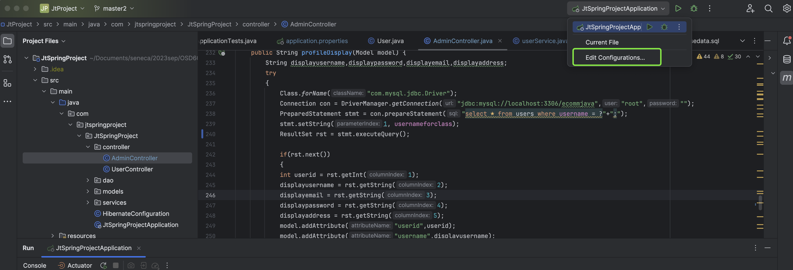

## Quickstart

1. Clone the repository
2. Open the project in your IDE: IntelliJ IDEA (recommended) or Eclipse
    * If you are using IntelliJ IDEA, make sure the IDE opens project as **Maven** and recognizes the project as a Spring Boot project. Also, you must change the working directory of the project so that the views (the actual web pages to be shown) are found by Spring Boot (check out [Web Directories IntelliJ IDEA](#web-directories).
3. Make sure you are in the `JtProject` directory
4. Configure the database connection in `application.properties` file (check the [Database](#database) section below for more info)
5. Run the project (by running the `main` method in `JtSpringProjectApplication.java`)
6. Open http://localhost:8080/ in your browser!

    you'll have to manually create an admin user in the database:
     * Username: `admin`
     * Password: `123`
   * Log in as a normal user:
     * Username: `lisa`
     * Password: `765`

When you run the project, the views should be found by Spring Boot and you should see a login page in http://localhost:8080/ (if not logged in previously)!

# Workflow
- 
### Models
- represent data as entity and relationship among them.

### View
- receive data from controller and show with frontend.

## Spring Boot

For any information about Spring Boot, here are some useful links!

## Preview

